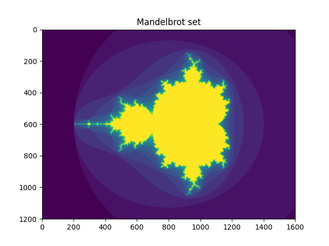
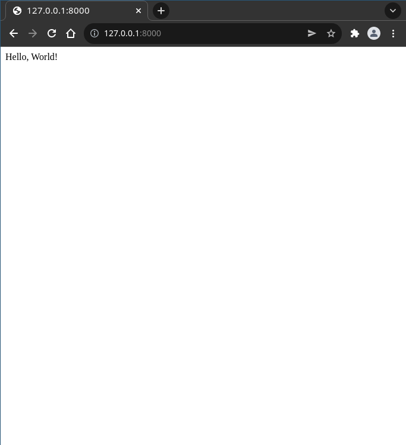

# Level 3:

## Python Script with dependencies
A Python script with dependencies
(see [python-script-with-dependencies](python-script-with-dependencies))

```shell
> cd python-script-with-dependencies
# build the image
> docker build -t python-script-lvl-3:latest .
# start a container using the image
> docker run -v $PWD:/usr/app python-script-lvl-3:latest
```
This generated a beautiful image for us `python-script-with-dependencies/mandelbrot.png`  

## A simple Python webapp
[flask-app](flask-app) can be build using
```shell
> docker build -f flask-app/Dockerfile -t flask-app:latest flask-app 
```
and run using
```shell
> docker run -v $PWD/flask-app:/usr/app -p 8000:5000 flask-app:latest
```
The app is now available at [http://127.0.0.1:8000](http://127.0.0.1:8000)  


To simplify the execution and configure the ports/volumes in code
we can use the tool `docker-compose`.
### [docker-compose](https://docs.docker.com/compose/)
Using `docker-compose` we can configure containers in code using `YAML`
to wrap the `flask-app` container config we create a `docker-compose.yml` file
```yaml
version: '3' # < required

services: # begins definition of services to run in composition
  flask-app: # start of definition of the "flask-app" service
    image: flask-app:latest # the image to use for the service
    build: # build config if the image is not available
      context: .
    ports: # ports to forward from the running container
      - "8000:5000"
    volumes: # volumes to mount into the container
      - ".:/usr/app"
    command: [ # the command to run in the container
       "flask", "run", "--host=0.0.0.0"
    ]
```
using this [`flask-app/docker-compose.yml`](flask-app/docker-compose.yml) file we can start the service using
```shell
> docker-compose -f flask-app/docker-compose.yml up
```
or from within the `flask-app` directory shortly
```shell
> docker-compose up
```
we can launch the app in detached mode using `-d`.  
To clean up and remove volumes and containers run
```shell
> docker-compose -f flask-app/docker-compose.yml down -v
```

## Django & PostgreSQL
Sometimes we want to launch multiple containers and want them to communicate in between.
Suppose we have a webapp that requires a running PostgreSQL instance.
See [django-postgres-docker-compose](django-postgres-docker-compose)
```shell
> cd django-postgres-docker-compose
# build & run the setup
> docker-compose up
```
## More resources
- A list of resources for `docker-compose`: https://github.com/docker/awesome-compose

